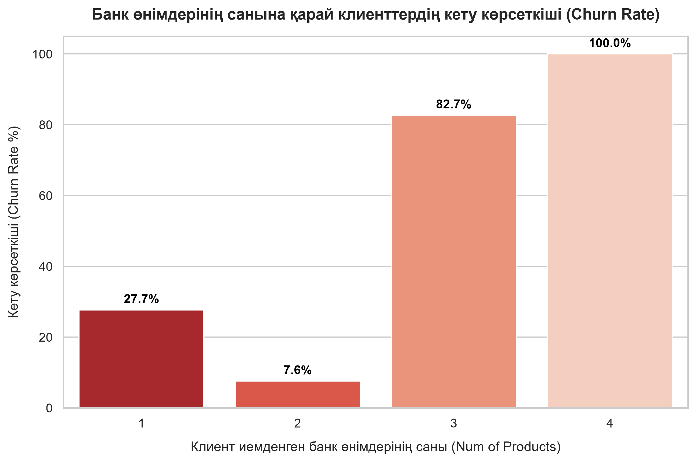

# 🏦 Comprehensive Bank Customer Analytics, Advanced SQL & Power BI Portfolio

This repository contains a professional, end-to-end data analytics and data science portfolio. It leverages real-world data from 10,000 bank customers to extract deep business insights, build an interactive Business Intelligence (BI) infrastructure, and deploy predictive AI models.

---

## 🛠️ Project Structure & Pipeline
The project is strictly modularized into production-standard phases to maintain a clean engineering workflow:

1. **`1_data_collection.ipynb`** — Fetches real banking data from the international OpenML server and ingests it into a local production SQLite database (`bank_analytics.db`).
2. **`2_data_cleaning.ipynb`** — Handles data preprocessing, type formatting, column normalization, and prepares clean master datasets.
3. **`3_data_analysis.ipynb`** — Executes complex relational SQL business queries, implements Window Functions, and exports transaction pipelines.
4. **`4_machine_learning.ipynb`** — Trains a `RandomForestClassifier` model optimized with class balancing to predict future customer churn risks.

---

## 💎 Project 1: Data Science & Machine Learning Pipeline

### 💻 Tech Stack & Tools (Data Science)
* **Languages:** Python, SQL
* **Libraries:** Pandas, Scikit-Learn, Matplotlib, Seaborn, SQLite3, NumPy
* **Tools:** Jupyter Notebook, Git, GitHub

### 📈 Key Business Insights & AI Modeling

* **Product Churn Corelation:** The number of bank products (`num_products`) held by a customer has a direct impact on defection risks. Customers with 3 or 4 products are in the highest risk zone, showing absolute churn rates.
* **Predictive ML Model:** Deployed a supervised Machine Learning pipeline utilizing `RandomForestClassifier` to flag high-risk accounts automatically before they abandon the bank.

---

## 📊 Project 2: Advanced SQL & Interactive Power BI Dashboard

### 💻 Tech Stack & Tools (Business Intelligence)
* **Database Engine:** SQLite (Relational Database Management System)
* **BI Platform:** Microsoft Power BI Desktop
* **Data Pipelines:** Python Pandas (`to_excel` and `to_sql` automation engines)

### 🚀 Advanced SQL Engineering
To simulate enterprise-level data architectures, an additional **`transactions`** ledger table was generated and linked to the customer master table via a **1:N (One-to-Many)** relationship. The following advanced relational database techniques were successfully implemented:
* **Relational Joins:** Executed optimized `INNER JOIN` operations to unify customer profiles with real-time purchasing behavior.
* **Window Functions (`OVER / PARTITION BY`):** Computed running customer-level metrics (e.g., `SUM(amount)` and `MAX(amount)`) across analytical windows without losing individual transaction-level rows.
* **Analytical Ranking (`DENSE_RANK()`):** Implemented rank partitioning to categorize transactions by financial value (`ORDER BY amount DESC`) within each unique customer window.

### 🎨 Enterprise Power BI Visualizations
Designed an interactive, multi-page business intelligence framework tailored for executive decision-making:
* **Page 1 (Customer Demographics & Risk Profile):** Displays key performance indicators (KPIs) like total active unique customers (distinct count), dynamic churn rates, and geolocational distribution (France, Germany, Spain).
* **Page 2 (Transaction Category Analytics):** Visualizes financial behavior across core spending segments (Supermarket, Apparel, Electronics, Cafe, Gas Station) via a high-fidelity Pie Chart.
* **Global Synchronization (`Sync Slicers`):** Cross-page slicers are fully synchronized. Filtering by region (e.g., *Germany*) instantly updates both customer risk profiles and spending pattern visualizers concurrently.

---

## 📈 Final Business Takeaways
By combining programmatic data science (Python), backend data modeling (SQL), and intuitive executive reporting (Power BI), this framework transforms raw banking metrics into actionable strategies, allowing management to mitigate customer attrition and track real-time transactional behavior in under 1 second.
